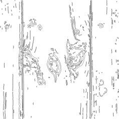

# Wood Surface to SVG
Based on paper dealing with gradient magnitude based support regions (GMSR)
https://arxiv.org/pdf/2407.03630v1

## Description
This tool extracts wood surface features using Gradient Magnitude Support Regions (GMSR) and outputs them as vector graphics (SVG). It's particularly useful for detecting features and defects in wood surfaces.

## Example Results

Default processing uses a 900x900 pixel region starting at position (200,400): but this is just to focus on intresting features on the test image. you can adapt it in the code to your needs.

|  Cropped Region | GMSR Features (SVG) |
|----------------------------|----------------|
|  |  |

The SVG output contains pure vector paths of the detected features

## TODO
- make it faster
- tune parameters
- figure out if using the full paper approch has benefits

## Installation

### Prerequisites
- Python 3.8 or higher
- CUDA toolkit (optional, for GPU acceleration)

### Required Python Packages
```bash
pip install numpy matplotlib scipy scikit-image
```

### Optional GPU Acceleration
For GPU acceleration (NVIDIA GPUs only):
```bash
# Replace 11x with your CUDA version (e.g., 118 for CUDA 11.8)
pip install cupy-cuda11x
```

## Usage

### Basic Usage
```bash
python gmsr_inspection.py <image_path> [output_svg] [num_cores]
```

### Parameters
- `image_path`: Path to the input wood surface image
- `output_svg`: (Optional) Path for the output SVG file
- `num_cores`: (Optional) Number of CPU cores to use (default: 8)

### Examples
1. Basic processing with display:
```bash
python gmsr_inspection.py wood_image.jpg
```

2. Save features as SVG:
```bash
python gmsr_inspection.py wood_image.jpg features.svg
```

3. Specify number of CPU cores:
```bash
python gmsr_inspection.py wood_image.jpg features.svg 4
```

## Output
- Displays original image and detected features
- If SVG output is specified, generates vector graphics of the detected features
- SVG output contains pure vector paths, suitable for scaling and editing

## Performance Notes
- GPU acceleration is automatically used if CUDA and CuPy are available
- Default crop region is 900x900 pixels starting at (200,400)
- Processing time depends on image size and number of features
- Using 4-8 CPU cores is recommended for optimal performance

## Sources

This implementation is based on the following papers:

1. Unsalan, C. (2024). Wood Surface Inspection Using Structural and Conditional Statistical Features. arXiv:2407.03630v1 [cs.CV]

The GMSR (Gradient Magnitude Support Regions) method was originally introduced in:

2. Unsalan, C. (2006). Gradient magnitude based support regions in structural land use classification. IEEE Geoscience and Remote Sensing Letters, 3(4), 546-550.

Found via [Google Scholar citations](https://scholar.google.com/scholar?cites=1305586042728443408&as_sdt=2005&sciodt=0,5&hl=en).

source of wood surface image is pixnio[.com]  
thanks cursor for the code!
